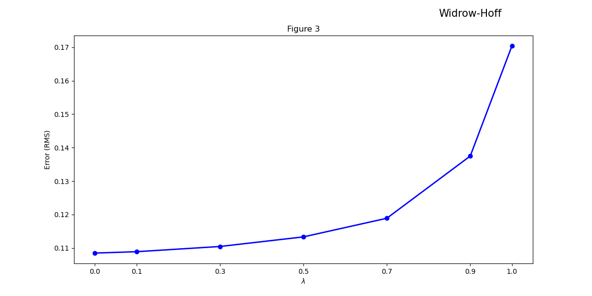
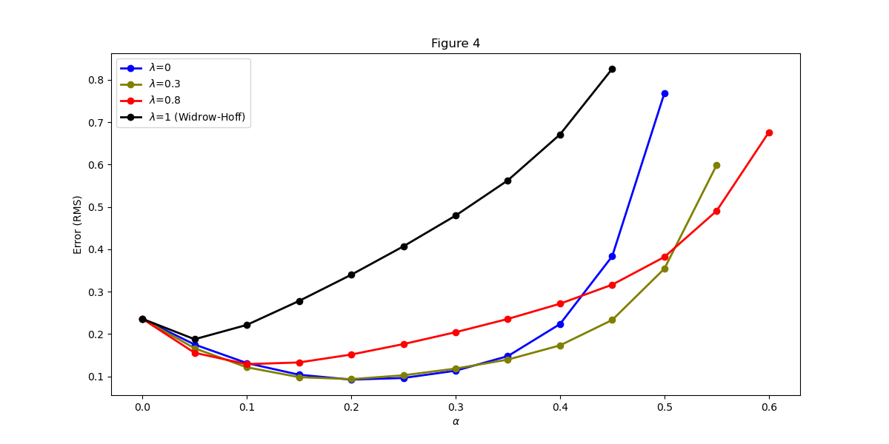
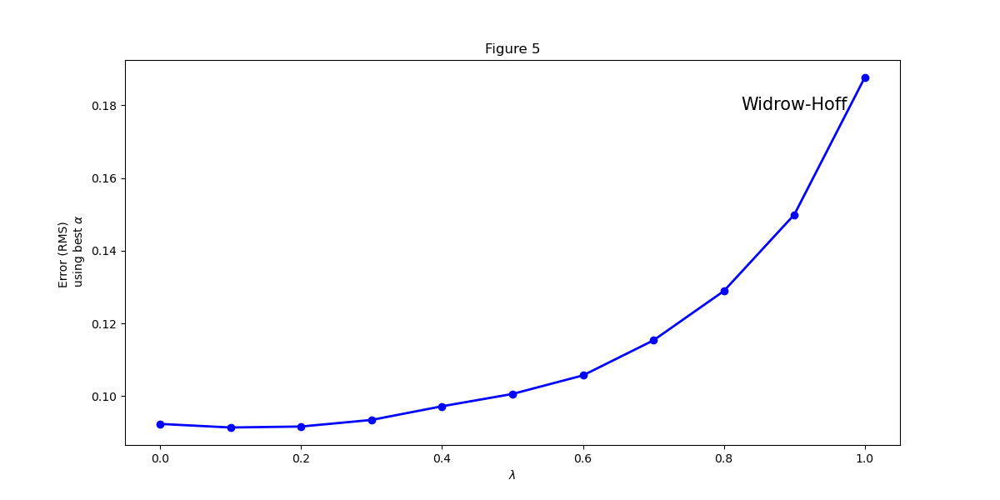
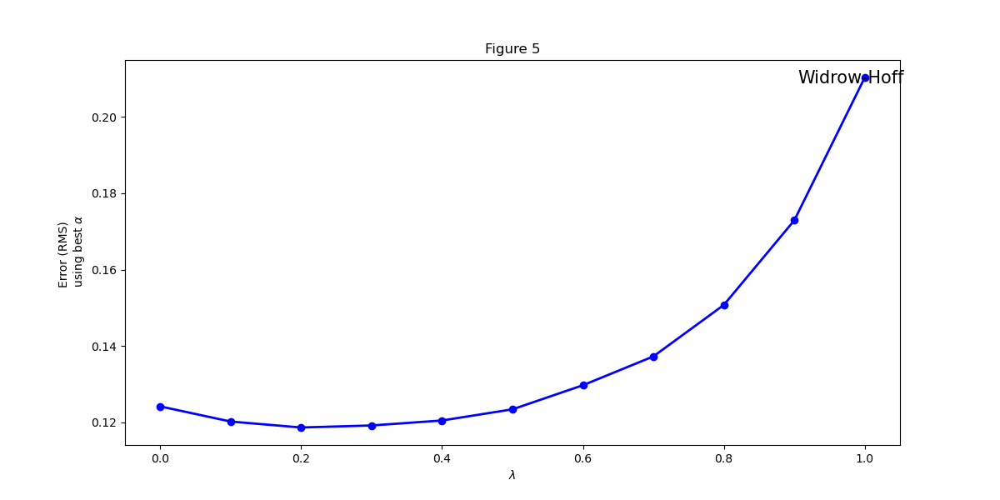

# OMSCS-CS-7642: Reinforcement Learning
## Language used: Python
## Project 1 - Replication of Figures from Sutton's paper and Observations

### How to install and run the script

    Install latest python version from https://www.python.org/downloads/
    pip install numpy  
    pip install matplotlib  
    pip install pandas

### `TD_Learning.py`
path to python installation/python3 TD_learning.py -options  
`-options`: experimental True for additional graphs

##Replication of the random walk experiment in paper entitled __*Learning to Predict by the Methods of Temporal Differences*__ by Sutton 1988   
   

##Additional experiment for Figure 5 with reduce training sequences to 5 instead of 10 per training set
   

