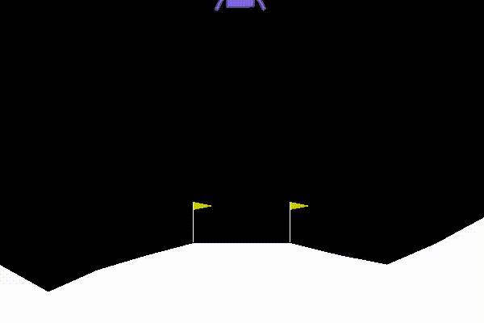
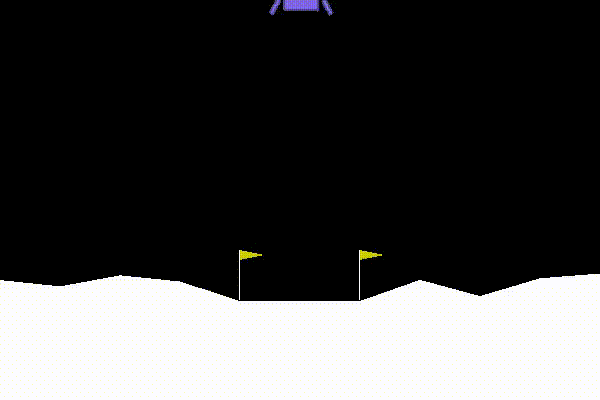
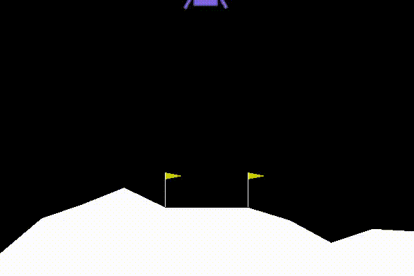
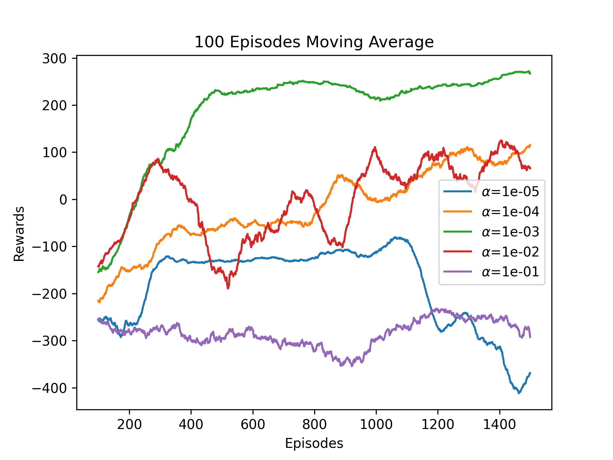
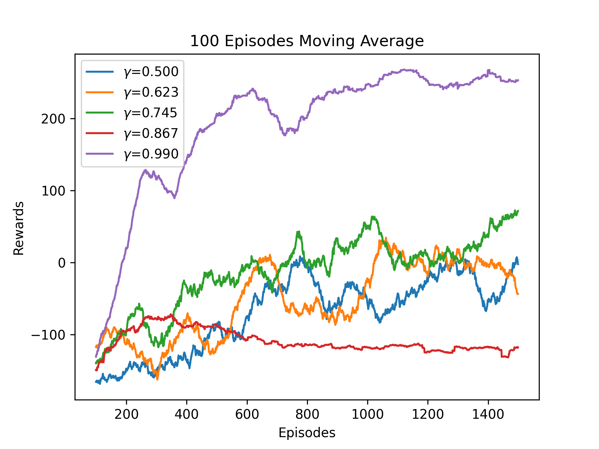
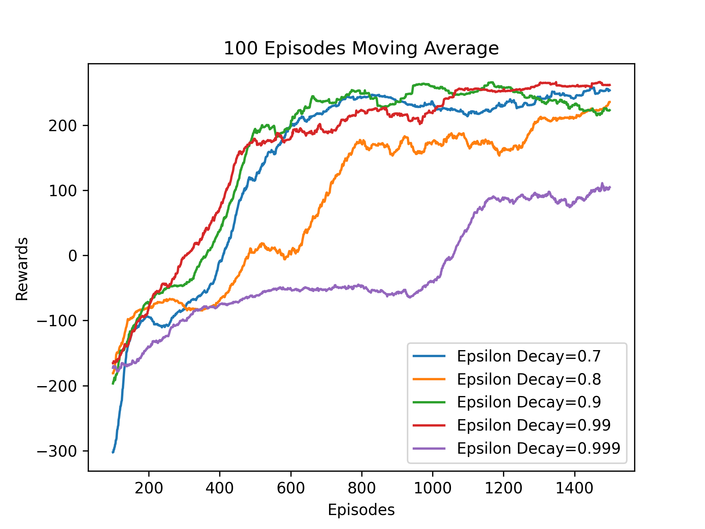

# OMSCS-CS-7642: Reinforcement Learning

## Language used: Python

## Project 2 - Solving Lunar Lander Environment using DQN Algorithm

### How to install and run the script

    Install python version 3.6.x from https://www.python.org/downloads/
    pip install numpy=1.18.0
    pip install matplotlib  
    pip install pandas
    pip install gym==0.17.2
    pip install torch

### `Project2_DQN_Lunar_Lander.py`

path to python installation/python3 Project2_DQN_Lunar_Lander.py -option  
 <table style="width:100%">
  <tr>
    <th>Option</th>
    <th>Description</th>
  </tr>
  <tr>
    <td>1</td>
    <td>Trains the agent</td>
  </tr>
  <tr>
    <td>2</td>
    <td>Tests the trained agent</td>
  </tr>
  <tr>
    <td>3</td>
    <td>Train with different learning rates</td>
  </tr>
  <tr>
    <td>4</td>
    <td>Train with different discount rates</td>
  </tr>
  <tr>
    <td>5</td>
    <td>Train with different epsilon decays</td>
  </tr>
</table> 

## Untrained DQN Agent
   
## DQN Agent after 150 Episodes
 
## Trained DQN Agent  

## Hyper parameter Graphs
## Learning Rate

## Discount Rate

## Epsilon Decay

