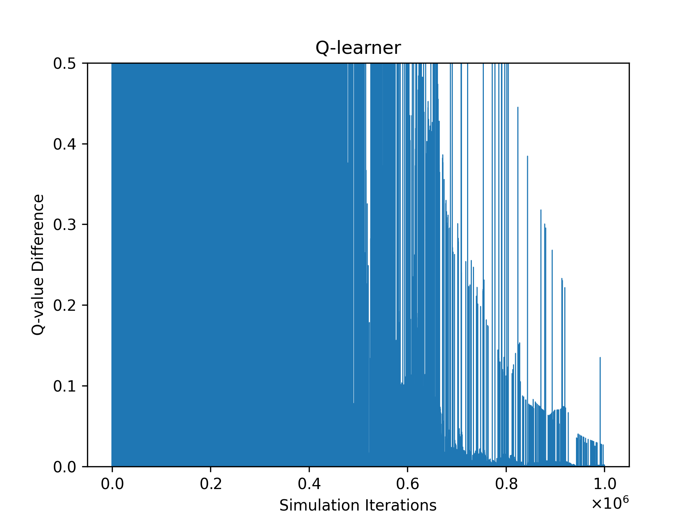
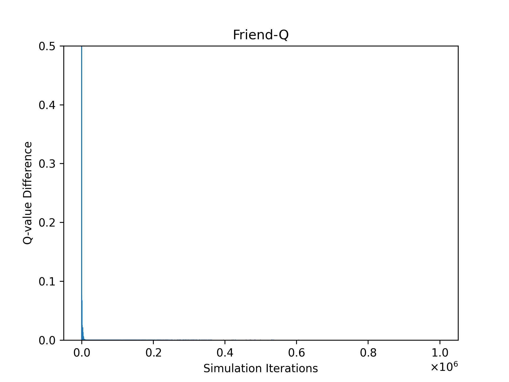
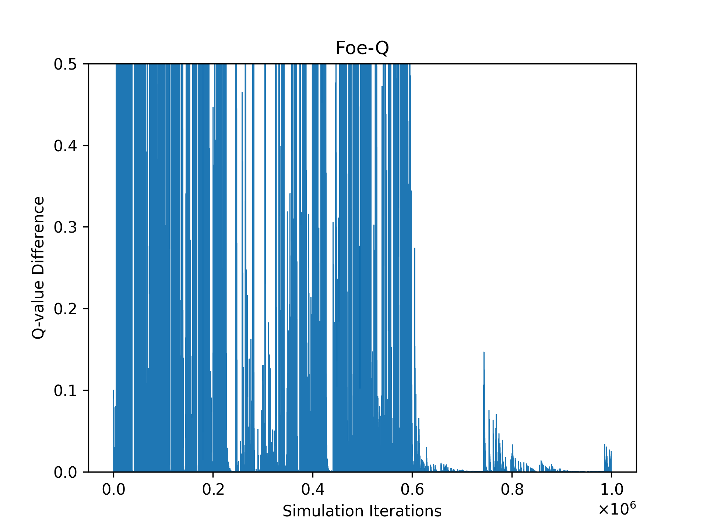
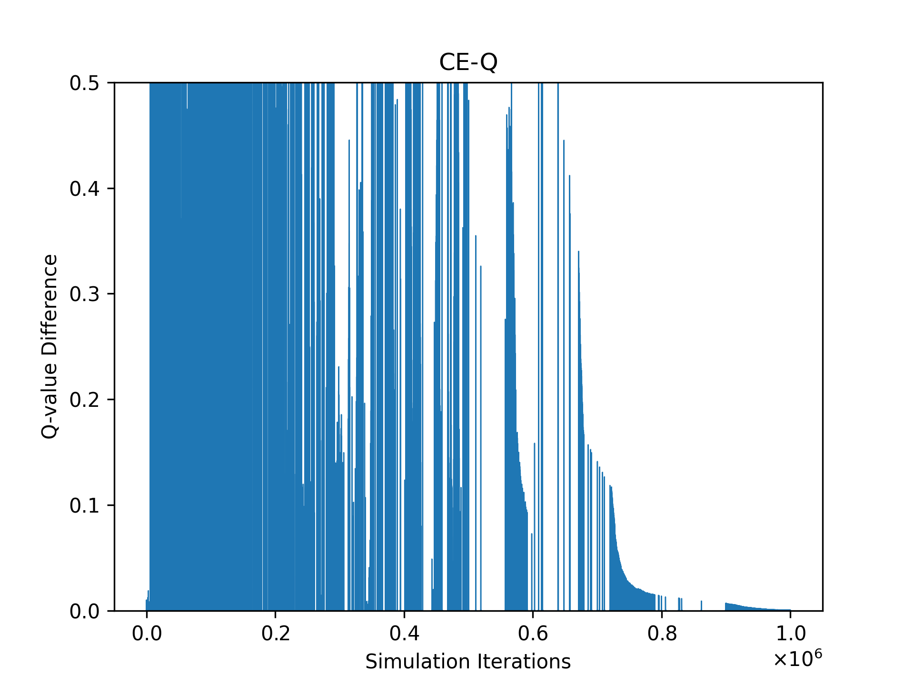

# OMSCS-CS-7642: Reinforcement Learning

## Language used: Python

## Project 3 - Soccer Game and Learning algorithms

### How to install and run the script

    Install python version 3.6.x from https://www.python.org/downloads/
    pip install numpy=1.18.0
    pip install matplotlib  
    pip install scipy
    pip install cvxopt
    pip install pickle

### `Project3_Soccer_Game.py`

path to python installation/python3 Project3_Soccer_Game.py -option  
 <table style="width:100%">
  <tr>
    <th>Option</th>
    <th>Description</th>
  </tr>
  <tr>
    <td>1</td>
    <td>Solver Q-Learning</td>
  </tr>
  <tr>
    <td>2</td>
    <td>Solver Friend-Q</td>
  </tr>
  <tr>
    <td>3</td>
    <td>Solver Foe-Q</td>
  </tr>
  <tr>
    <td>4</td>
    <td>Solver CE-Q</td>
  </tr>
</table> 

## Q-Learning

## Friend-Q

## Foe-Q

## Correlated-Q

